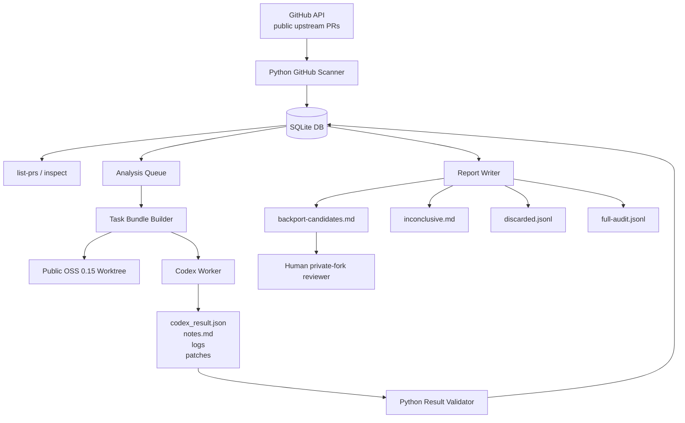
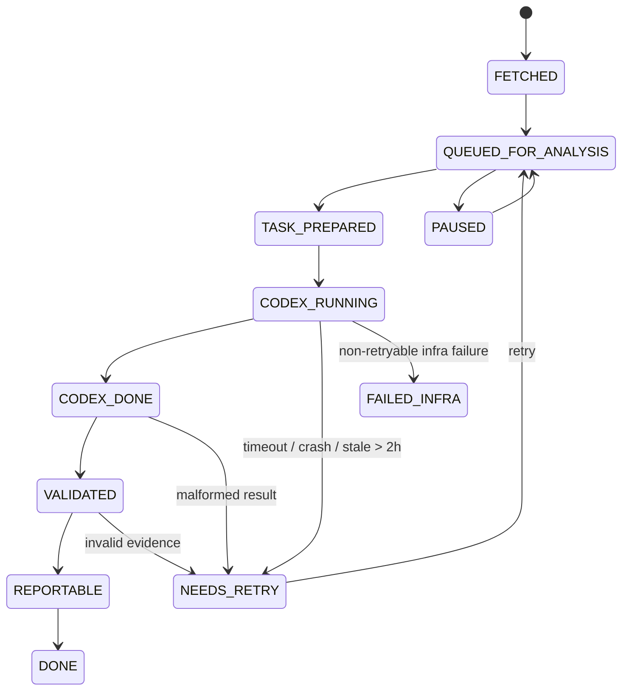
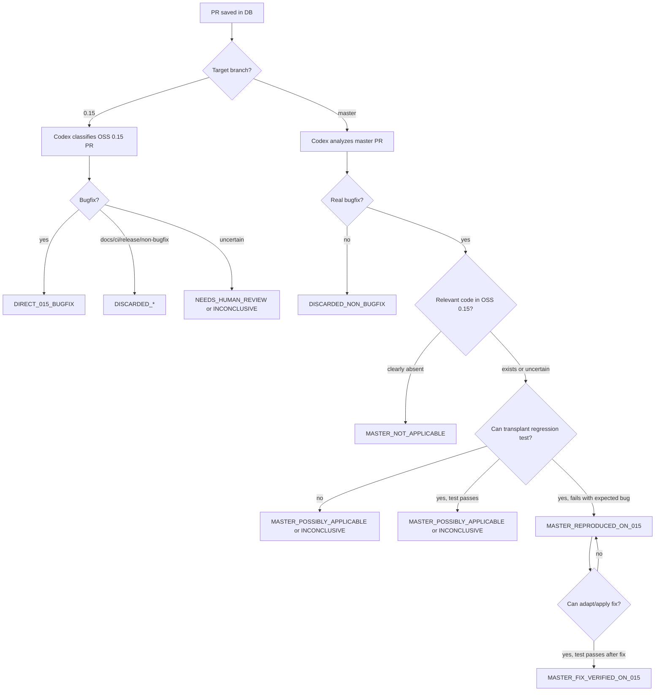

# Backport Harness Design

## 1. Purpose

The Backport Harness is a semi-automated system for detecting upstream open-source bugfixes that may need to be backported to a private fork.

The system monitors public GitHub pull requests merged into two upstream branches:

- `master`
- `0.15`

The private fork is based on upstream `0.15`, but the harness must not access the private fork. The harness works only with the public upstream repository and the public upstream `0.15` branch. It produces a human review queue for engineers who will manually check and backport relevant fixes into the private fork.

## 2. Core idea

The harness is split into two layers:

1. **Python harness**: deterministic orchestration, storage, queueing, rate-limited GitHub scanning, Codex invocation, result validation, and report generation.
2. **Codex worker**: semantic code reasoning, PR classification, upstream `0.15` applicability analysis, test transplantation, test execution, and optional fix verification.

The Python harness is the source of truth. Codex is a smart worker, but its decisions must be validated and stored by the harness.

## 3. Security boundary

Codex and the harness may access:

- Public upstream GitHub PR metadata.
- Public upstream PR diffs.
- Public upstream `master` branch.
- Public upstream `0.15` branch.
- Local public OSS worktrees.
- Public test logs generated during analysis.

Codex and the harness must not access:

- Private fork.
- Private patches.
- Private repository history.
- Private business logic.
- Private test results.
- Any local directory containing private fork code.

The generated output is intentionally limited to a public-OSS-based candidate queue that humans review internally.

## 4. Primary requirements

### 4.1 Historical scan

The scanner must support explicit date ranges:

```bash
backport-harness scan --from-date 2024-01-01
backport-harness scan --from-date 2024-01-01 --to-date 2024-12-31
```

Semantics:

- `--from-date` means `merged_at >= from-date`.
- `--to-date` means `merged_at <= to-date`.
- If branch is omitted, scan both `master` and `0.15`.
- No `--since-days` option is needed.

### 4.2 Slow GitHub scanning

The scanner must be intentionally slow and polite to avoid hitting API limits or triggering abuse detection.

It must support:

- Delay between requests.
- Delay between pages.
- GitHub rate-limit header handling.
- Exponential backoff for `403`, `429`, and `5xx`.
- Idempotent reruns.
- Partial scan audit records.

### 4.3 Separate scan and analysis

Scanning must not automatically invoke Codex.

The expected workflow is:

```text
scan -> list saved PRs -> inspect selected PRs -> analyze limited batch -> report
```

This is necessary because Codex usage is limited and analysis may need to happen gradually across multiple sessions.

### 4.4 List saved PRs

The harness must support listing PRs already saved in SQLite before running analysis:

```bash
backport-harness list-prs
backport-harness list-prs --branch master
backport-harness list-prs --branch 0.15
backport-harness list-prs --status QUEUED_FOR_ANALYSIS
backport-harness list-prs --from-date 2024-01-01 --to-date 2024-12-31
backport-harness list-prs --limit 50
```

### 4.5 Resumability

The harness must be safe to stop and restart.

It must support:

- Durable SQLite state.
- Per-PR atomic analysis.
- Analysis attempt records.
- Stale Codex run recovery.
- Retry of failed or inconclusive PRs.
- Regeneration of reports from SQLite at any time.

### 4.6 Codex timeout

Each Codex analysis run has a default timeout of **2 hours**.

If a PR remains in `CODEX_RUNNING` for more than 2 hours, it is considered stale and should be recovered with:

```bash
backport-harness recover-stale
```

Default behavior:

```text
CODEX_RUNNING older than 2 hours -> NEEDS_RETRY
```

### 4.7 Human review output

The harness produces human-readable and machine-readable reports:

- `backport-candidates.md`
- `inconclusive.md`
- `discarded.jsonl`
- `full-audit.jsonl`

Reports are generated from SQLite, not directly from live Codex output.

---

## 5. High-level architecture



## 6. Component architecture

### 6.1 CLI

The CLI is the main interface.

Required commands:

```bash
backport-harness scan --from-date 2024-01-01 --to-date 2024-12-31
backport-harness list-prs
backport-harness inspect --pr 12345
backport-harness analyze --limit 5
backport-harness analyze --pr 12345
backport-harness analyze --limit 5 --dry-run
backport-harness retry --status FAILED_INFRA --limit 3
backport-harness recover-stale
backport-harness report
backport-harness review --pr 12345 --status accepted_for_backport
```

### 6.2 GitHub scanner

Responsibilities:

- Fetch merged PRs from public upstream GitHub repository.
- Scan by `merged_at` date range.
- Support branch filter.
- Store PR metadata.
- Store changed files.
- Avoid duplicate records.
- Respect GitHub rate limits.
- Record scan runs for audit.

The scanner should be idempotent. Running the same scan twice must not duplicate PRs.

### 6.3 SQLite storage

SQLite is the source of truth.

It stores:

- PR metadata.
- Changed files.
- Analysis queue state.
- Codex run attempts.
- Decisions.
- Evidence.
- Test runs.
- Human review status.
- Scan run audit records.

### 6.4 Analysis queue

The queue decouples broad scanning from expensive Codex analysis.

The queue supports:

- Status.
- Priority.
- Attempts.
- Locking.
- Retry scheduling.
- Last error.
- Created/updated timestamps.

### 6.5 Worktree manager

Responsibilities:

- Clone upstream repo if absent.
- Fetch upstream branches.
- Create clean per-PR public OSS `0.15` worktree.
- Remove worktrees after analysis if configured.
- Ensure private repo paths are never used.

### 6.6 Task bundle builder

For each PR, the harness creates a task bundle:

```text
workspace/tasks/pr-12345/
  pr.json
  files_changed.json
  pr.diff
  instructions.md
  oss_015_worktree/
  output/
    codex_result.json
    notes.md
    logs/
    patches/
```

This bundle is the only context Codex should need.

### 6.7 Codex runner

Responsibilities:

- Invoke Codex in non-interactive mode.
- Set working directory to task bundle or worktree.
- Enforce 2-hour timeout.
- Capture stdout and stderr.
- Persist raw logs.
- Record run status.
- Mark stale or failed runs for retry.

### 6.8 Result validator

The harness must validate Codex output before storing a decision.

Validation includes:

- JSON file exists.
- JSON schema is valid.
- Decision value is known.
- Confidence value is known.
- Required evidence is present.
- Referenced log files exist.
- Referenced patch files exist when required.
- Test exit codes match claimed results.

### 6.9 Report writer

Reports are generated from SQLite.

The report writer must not rely on temporary task directories as the source of truth. It may link to stored logs and patches, but all decisions and core metadata come from SQLite.

---

## 7. Data model

### 7.1 PRs

```sql
CREATE TABLE IF NOT EXISTS prs (
    id INTEGER PRIMARY KEY AUTOINCREMENT,
    github_pr_number INTEGER NOT NULL,
    github_pr_url TEXT NOT NULL,
    title TEXT NOT NULL,
    body TEXT,
    source_branch TEXT,
    target_branch TEXT NOT NULL,
    merged_commit_sha TEXT,
    created_at TEXT,
    updated_at TEXT,
    closed_at TEXT,
    merged_at TEXT NOT NULL,
    author TEXT,
    created_in_db_at TEXT NOT NULL,
    updated_in_db_at TEXT NOT NULL,
    UNIQUE(github_pr_number, target_branch)
);
```

### 7.2 PR files

```sql
CREATE TABLE IF NOT EXISTS pr_files (
    id INTEGER PRIMARY KEY AUTOINCREMENT,
    pr_id INTEGER NOT NULL,
    filename TEXT NOT NULL,
    status TEXT,
    additions INTEGER,
    deletions INTEGER,
    is_test_file INTEGER NOT NULL DEFAULT 0,
    is_docs_file INTEGER NOT NULL DEFAULT 0,
    is_ci_file INTEGER NOT NULL DEFAULT 0,
    FOREIGN KEY(pr_id) REFERENCES prs(id)
);
```

### 7.3 Scan runs

```sql
CREATE TABLE IF NOT EXISTS scan_runs (
    id INTEGER PRIMARY KEY AUTOINCREMENT,
    branch TEXT NOT NULL,
    from_date TEXT NOT NULL,
    to_date TEXT,
    status TEXT NOT NULL,
    started_at TEXT NOT NULL,
    finished_at TEXT,
    prs_seen INTEGER DEFAULT 0,
    prs_saved INTEGER DEFAULT 0,
    last_error TEXT
);
```

### 7.4 Analysis queue

```sql
CREATE TABLE IF NOT EXISTS analysis_queue (
    id INTEGER PRIMARY KEY AUTOINCREMENT,
    pr_id INTEGER NOT NULL,
    status TEXT NOT NULL,
    priority INTEGER NOT NULL DEFAULT 100,
    attempts INTEGER NOT NULL DEFAULT 0,
    next_retry_at TEXT,
    locked_at TEXT,
    locked_by TEXT,
    last_error TEXT,
    created_at TEXT NOT NULL,
    updated_at TEXT NOT NULL,
    FOREIGN KEY(pr_id) REFERENCES prs(id),
    UNIQUE(pr_id)
);
```

### 7.5 Analysis runs

```sql
CREATE TABLE IF NOT EXISTS analysis_runs (
    id INTEGER PRIMARY KEY AUTOINCREMENT,
    pr_id INTEGER NOT NULL,
    run_id TEXT NOT NULL,
    started_at TEXT NOT NULL,
    finished_at TEXT,
    codex_exit_code INTEGER,
    status TEXT NOT NULL,
    task_dir TEXT NOT NULL,
    result_json_path TEXT,
    notes_path TEXT,
    stdout_log_path TEXT,
    stderr_log_path TEXT,
    FOREIGN KEY(pr_id) REFERENCES prs(id)
);
```

### 7.6 Decisions

```sql
CREATE TABLE IF NOT EXISTS decisions (
    id INTEGER PRIMARY KEY AUTOINCREMENT,
    pr_id INTEGER NOT NULL,
    analysis_run_id INTEGER NOT NULL,
    decision TEXT NOT NULL,
    confidence TEXT NOT NULL,
    bugfix_classification TEXT,
    applies_to_oss_015 INTEGER,
    reason TEXT NOT NULL,
    human_action TEXT,
    created_at TEXT NOT NULL,
    FOREIGN KEY(pr_id) REFERENCES prs(id),
    FOREIGN KEY(analysis_run_id) REFERENCES analysis_runs(id)
);
```

### 7.7 Evidence

```sql
CREATE TABLE IF NOT EXISTS evidence (
    id INTEGER PRIMARY KEY AUTOINCREMENT,
    decision_id INTEGER NOT NULL,
    evidence_type TEXT NOT NULL,
    description TEXT NOT NULL,
    file_path TEXT,
    command TEXT,
    exit_code INTEGER,
    log_path TEXT,
    FOREIGN KEY(decision_id) REFERENCES decisions(id)
);
```

### 7.8 Test runs

```sql
CREATE TABLE IF NOT EXISTS test_runs (
    id INTEGER PRIMARY KEY AUTOINCREMENT,
    analysis_run_id INTEGER NOT NULL,
    phase TEXT NOT NULL,
    command TEXT,
    exit_code INTEGER,
    result TEXT NOT NULL,
    log_path TEXT,
    started_at TEXT,
    finished_at TEXT,
    FOREIGN KEY(analysis_run_id) REFERENCES analysis_runs(id)
);
```

### 7.9 Human reviews

```sql
CREATE TABLE IF NOT EXISTS human_reviews (
    id INTEGER PRIMARY KEY AUTOINCREMENT,
    pr_id INTEGER NOT NULL,
    status TEXT NOT NULL,
    reviewer TEXT,
    comment TEXT,
    updated_at TEXT NOT NULL,
    FOREIGN KEY(pr_id) REFERENCES prs(id)
);
```

---

## 8. State machine

### 8.1 Queue statuses

```text
FETCHED
QUEUED_FOR_ANALYSIS
TASK_PREPARED
CODEX_RUNNING
CODEX_DONE
VALIDATED
REPORTABLE
DONE
NEEDS_RETRY
FAILED_INFRA
PAUSED
```

### 8.2 Decision statuses

```text
DIRECT_015_BUGFIX
MASTER_NOT_APPLICABLE
MASTER_POSSIBLY_APPLICABLE
MASTER_REPRODUCED_ON_015
MASTER_FIX_VERIFIED_ON_015
INCONCLUSIVE
NEEDS_HUMAN_REVIEW
DISCARDED_NON_BUGFIX
DISCARDED_DOCS_ONLY
DISCARDED_CI_ONLY
DISCARDED_RELEASE_ONLY
FAILED_INFRA
```

### 8.3 State flow



### 8.4 Decision flow



---

## 9. Codex output contract

Codex must write strict JSON to:

```text
output/codex_result.json
```

Example:

```json
{
  "schema_version": 1,
  "pr_number": 12345,
  "target_branch": "master",
  "decision": "MASTER_FIX_VERIFIED_ON_015",
  "confidence": "very_high",
  "bugfix_classification": "correctness_bugfix",
  "summary": "Fixes a null handling bug in compaction scheduling.",
  "applicability": {
    "applies_to_oss_015": true,
    "reason": "The affected class and method exist in OSS 0.15 and contain equivalent logic."
  },
  "touched_components": [
    "hudi-client",
    "compaction"
  ],
  "production_files_relevant_to_015": [
    "hudi-client/src/main/java/example/Foo.java"
  ],
  "test_files_used": [
    "hudi-client/src/test/java/example/TestFoo.java"
  ],
  "test_transplant": {
    "attempted": true,
    "result": "applied_and_compiled",
    "notes": "Adapted imports and constructor arguments to 0.15 APIs."
  },
  "test_before_fix": {
    "attempted": true,
    "command": "mvn -pl hudi-client -Dtest=TestFoo#testNullCase test",
    "exit_code": 1,
    "result": "failed_with_expected_error",
    "log_path": "output/logs/test-before-fix.log"
  },
  "fix_verification": {
    "attempted": true,
    "command": "mvn -pl hudi-client -Dtest=TestFoo#testNullCase test",
    "exit_code": 0,
    "result": "passed_after_adapted_fix",
    "patch_path": "output/patches/adapted-fix.patch",
    "log_path": "output/logs/test-after-fix.log"
  },
  "evidence": [
    {
      "type": "code_presence",
      "description": "Class Foo exists in OSS 0.15."
    },
    {
      "type": "logic_match",
      "description": "The same null-unsafe branch exists in OSS 0.15."
    },
    {
      "type": "test_failure",
      "description": "Transplanted regression test fails before fix with the expected error.",
      "log_path": "output/logs/test-before-fix.log"
    },
    {
      "type": "test_pass",
      "description": "The same test passes after applying the adapted fix.",
      "log_path": "output/logs/test-after-fix.log"
    }
  ],
  "human_action": "Review adapted patch and backport to private fork."
}
```

---

## 10. Result validation rules

### 10.1 Generic validation

All results require:

- `schema_version`.
- `pr_number`.
- `target_branch`.
- `decision`.
- `confidence`.
- `summary`.
- `reason` either directly or inside `applicability.reason`.
- Known decision enum.
- Known confidence enum.

### 10.2 `MASTER_FIX_VERIFIED_ON_015`

Require:

- `test_before_fix.attempted = true`.
- `test_before_fix.exit_code != 0`.
- `fix_verification.attempted = true`.
- `fix_verification.exit_code = 0`.
- `fix_verification.patch_path` exists.
- At least one `test_failure` evidence item.
- At least one `test_pass` evidence item.

### 10.3 `MASTER_REPRODUCED_ON_015`

Require:

- `test_before_fix.attempted = true`.
- `test_before_fix.exit_code != 0`.
- Expected failure explanation.
- Test log path exists.

### 10.4 `MASTER_NOT_APPLICABLE`

Require at least one strong reason:

- Affected file absent in `0.15`.
- Affected class absent in `0.15`.
- Affected module absent in `0.15`.
- Feature absent in `0.15`.
- Bug introduced after `0.15`.

### 10.5 `INCONCLUSIVE`

Require an explicit cause:

- Test does not apply.
- Test does not compile.
- Missing old API equivalent.
- Environment issue.
- Flaky test.
- Codex could not determine safely.

---

## 11. GitHub scanning behavior

The scanner must use `merged_at` as the filter date.

Pseudo-flow:

```text
for branch in selected_branches:
    create scan_run
    query merged PRs where base branch = branch and merged_at in date range
    for each page:
        respect rate limits
        sleep page_delay_seconds
        for each PR:
            fetch or reuse changed files
            upsert PR
            upsert PR files
            create or update analysis_queue row
            sleep request_delay_seconds
    mark scan_run successful
```

Recommended config:

```yaml
github:
  owner: apache
  repo: hudi
  branches:
    - master
    - "0.15"
  token_env: GITHUB_TOKEN
  request_delay_seconds: 1.0
  page_delay_seconds: 2.0
  max_retries: 5
  backoff_multiplier: 2.0
  respect_rate_limit: true
```

---

## 12. Analysis behavior

Pseudo-flow:

```text
recover stale runs if configured
select N queued PRs by priority and date
for each PR:
    lock queue item
    create analysis_run
    create task bundle
    create clean 0.15 worktree
    invoke Codex with 2-hour timeout
    parse output
    validate result
    store decision and evidence
    update queue status
    continue to next PR
```

Each PR is analyzed atomically. If analysis is interrupted, only that PR needs recovery.

---

## 13. Retry behavior

Retries must preserve previous analysis runs.

A retry creates a new `analysis_runs` record and increments `analysis_queue.attempts`.

Retry examples:

```bash
backport-harness retry --status FAILED_INFRA --limit 3
backport-harness retry --status INCONCLUSIVE --limit 3
backport-harness retry --pr 12345
```

Default max attempts can be configurable, for example:

```yaml
analysis:
  max_attempts_per_pr: 2
```

---

## 14. Report behavior

### 14.1 Backport candidates

Include:

- `DIRECT_015_BUGFIX`
- `MASTER_REPRODUCED_ON_015`
- `MASTER_FIX_VERIFIED_ON_015`
- `NEEDS_HUMAN_REVIEW`

### 14.2 Inconclusive

Include:

- `INCONCLUSIVE`
- `FAILED_INFRA`
- `NEEDS_RETRY`

### 14.3 Discarded

Include:

- `MASTER_NOT_APPLICABLE`
- `DISCARDED_NON_BUGFIX`
- `DISCARDED_DOCS_ONLY`
- `DISCARDED_CI_ONLY`
- `DISCARDED_RELEASE_ONLY`

### 14.4 Full audit

Include all PRs, all decisions, all evidence, and latest human review status.

---

## 15. Suggested Python package structure

```text
backport-harness/
  pyproject.toml
  README.md
  config.yaml

  backport_harness/
    __init__.py
    main.py
    config.py
    logging_config.py

    github_client.py
    models.py

    storage.py
    migrations/
      001_initial.sql

    repo_manager.py
    worktree_manager.py

    task_builder.py
    codex_runner.py
    codex_result.py
    result_validator.py

    state_machine.py
    report_writer.py

    commands/
      scan.py
      list_prs.py
      inspect.py
      analyze.py
      retry.py
      recover_stale.py
      report.py
      review.py

  prompts/
    analyze_015_pr.md
    analyze_master_pr.md
    transplant_test.md
    verify_fix.md

  reports/
    backport-candidates.md
    inconclusive.md
    discarded.jsonl
    full-audit.jsonl

  workspace/
    upstream/
    worktrees/
    tasks/
    runs/

  tests/
    test_state_machine.py
    test_result_validator.py
    test_report_writer.py
    test_scan_filters.py
```

---

## 16. MVP scope

The first useful version should include:

- SQLite schema and migrations.
- `scan --from-date [--to-date]`.
- Slow GitHub scanning.
- Idempotent PR storage.
- `list-prs`.
- `inspect --pr`.
- Analysis queue.
- Worktree and task bundle generation.
- Codex invocation with 2-hour timeout.
- Strict result parsing and validation.
- `analyze --limit`.
- `analyze --dry-run`.
- `recover-stale`.
- `retry`.
- `report`.

The first Codex prompt may do only:

- PR classification.
- `0.15` direct bugfix detection.
- Master PR rough applicability to public OSS `0.15`.

Test transplantation can be added after the queue is reliable.

---

## 17. Non-goals

The harness does not:

- Backport directly into the private fork.
- Push commits.
- Open private-fork PRs.
- Expose private code to Codex.
- Guarantee that every candidate is truly applicable to the private fork.
- Guarantee that every discarded PR is irrelevant, although it should keep an audit trail.
- Replace human review.

---

## 18. Key design principles

1. **Private repo isolation**: no private code enters the Codex workspace.
2. **SQLite is source of truth**: temporary files are not authoritative.
3. **Scan broadly, analyze narrowly**: scanning is cheap; Codex analysis is limited.
4. **Resumable by default**: safe to stop after any PR.
5. **No silent uncertainty**: uncertain cases become `INCONCLUSIVE`, not discarded.
6. **Evidence-based decisions**: Python validates Codex claims against logs, patches, and schema.
7. **Human final authority**: reports prioritize review; humans perform actual private backport.
